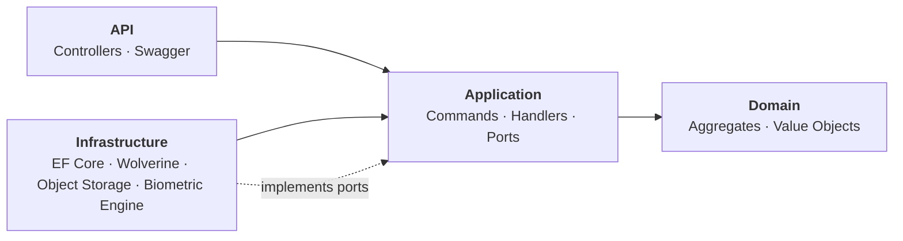
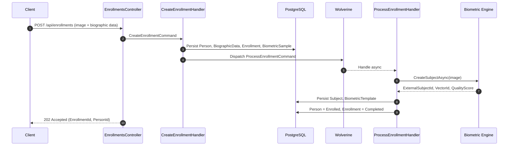
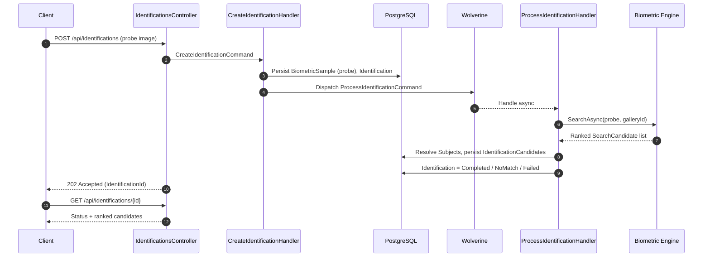

# Distributed Biometric Platform

Distributed biometric **enrollment** and **identification** platform built with .NET, Clean Architecture, and event-driven workflows.

[](https://github.com/Kamilla-Debona/distributed-biometric-platform/actions/workflows/ci.yml)


---

## Overview

The platform receives biometric samples, extracts biometric templates through a pluggable biometric engine, and answers **1:N identification** queries against enrolled galleries. It was designed to demonstrate a production-shaped .NET service:

- **Clean Architecture** — domain and application layers depend on nothing framework-specific.
- **Asynchronous workflows** — HTTP requests only persist intent; heavy work runs in message handlers dispatched via Wolverine, ready to move to Kafka without touching the application layer.
- **Pluggable providers** — biometric engine, object storage, and messaging are contracts, not implementations.
- **Deterministic fake biometric engine** so the whole pipeline can be exercised end-to-end without a commercial SDK.

## Tech Stack

| Concern              | Choice                                         |
| -------------------- | ---------------------------------------------- |
| Runtime              | .NET 10                                        |
| Web framework        | ASP.NET Core (Controllers + Swagger)           |
| Persistence          | Entity Framework Core + PostgreSQL 16          |
| Messaging            | Wolverine (in-process, Kafka-ready)            |
| Object storage       | Local FS (contract abstracts S3/GCS/Azure Blob) |
| Testing              | xUnit + NSubstitute                            |
| Containerization     | Multi-stage Docker + Docker Compose            |
| CI                   | GitHub Actions                                 |

## Architecture

Layered Clean Architecture. Dependencies point inward. Infrastructure implements ports declared in Application; the API composes them.



Full details in [`docs/architecture/ARCHITECTURE.md`](docs/architecture/ARCHITECTURE.md).
Design decisions in [`docs/decisions/`](docs/decisions/).

### Enrollment flow



### Identification flow



## Getting Started

### Prerequisites

- [Docker](https://www.docker.com/) with Compose plugin.
- (Optional, for local dev without containers) [.NET 10 SDK](https://dotnet.microsoft.com/download/dotnet/10.0) and PostgreSQL 16.

### Run with Docker Compose

```bash
cd deploy
docker compose up --build
```

This will start:

- **PostgreSQL 16** on `localhost:5432` (`postgres` / `postgres`, database `biometric_platform`).
- **API** on [http://localhost:8080](http://localhost:8080) — migrations are applied automatically on startup.

Open the Swagger UI at [http://localhost:8080/swagger](http://localhost:8080/swagger) to try the endpoints.

### Endpoints

| Method | Path                              | Description                                |
| ------ | --------------------------------- | ------------------------------------------ |
| POST   | `/api/enrollments`                | Create a new enrollment (multipart form)   |
| POST   | `/api/identifications`            | Submit a probe image for 1:N identification |
| GET    | `/api/identifications/{id}`       | Retrieve identification result with candidates |

## Running the Tests

```bash
dotnet test DistributedBiometricPlatform.slnx
```

Two test projects, xUnit + NSubstitute, no external infrastructure required.

- `tests/BiometricPlatform.Domain.Tests` — invariants and state transitions of aggregates.
- `tests/BiometricPlatform.Application.Tests` — command/query handlers with mocked ports.

## Repository Layout

```text
distributed-biometric-platform/
├── src/
│   ├── BiometricPlatform.Api             ASP.NET Core host, controllers, Swagger
│   ├── BiometricPlatform.Application     Commands, handlers, port interfaces
│   ├── BiometricPlatform.Contracts       Public DTOs (reserved for external contracts)
│   ├── BiometricPlatform.Domain          Aggregates, value objects, invariants
│   └── BiometricPlatform.Infrastructure  EF Core, PostgreSQL, storage, fake engine
├── tests/
│   ├── BiometricPlatform.Domain.Tests
│   └── BiometricPlatform.Application.Tests
├── deploy/
│   └── docker-compose.yml                Postgres + API
├── docs/
│   ├── architecture/                     Architecture overview
│   ├── decisions/                        Architecture Decision Records
│   ├── changelog/                        Release notes
│   └── roadmap/                          Planned features
└── .github/workflows/ci.yml              Restore · Build · Test · Format · Docker Build
```

## Roadmap

Delivered so far: **v0.1 → v0.5** — Clean Architecture foundation, enrollment pipeline, Wolverine messaging, end-to-end identification with ranked candidates and result query.

Next up:

- Enrollment lifecycle (delete, retry, quality rules).
- Kafka integration and worker services (distributed processing).
- Vector database (PGVector / Qdrant) for template similarity search.
- Authentication and audit logging.

Full plan in [`docs/roadmap/ROADMAP.md`](docs/roadmap/ROADMAP.md).

## Documentation

- [Architecture](docs/architecture/ARCHITECTURE.md)
- [ADR-001 — Adopt Clean Architecture](docs/decisions/ADR-001-initial-architecture.md)
- [Changelog](docs/changelog/CHANGELOG.md)
- [Roadmap](docs/roadmap/ROADMAP.md)

## Author

Built by **Kamilla Debona** as a portfolio project exploring distributed systems, Clean Architecture, and domain-driven design in .NET.
